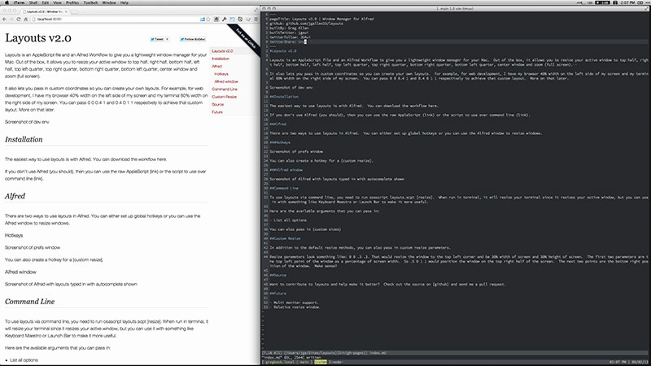
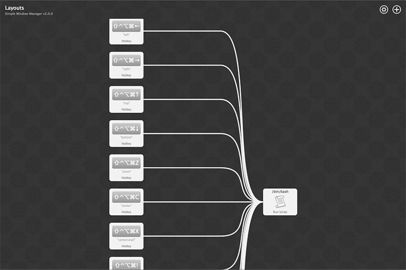

#Layouts v2.0

Layouts is an [AppleScript](https://github.com/jgallen23/layouts/blob/master/dist/layouts.applescript) file and an [Alfred Workflow](https://github.com/jgallen23/layouts/raw/master/dist/Layouts.alfredworkflow) to give you a lightweight window manager for your Mac.  Out of the box, it allows you to resize your active window to top half, right half, bottom half, left half, top left quarter, top right quarter, bottom right quarter, bottom left quarter, center window and zoom (full screen).

It also lets you pass in custom coordinates so you can create your own layouts.  For example, for web development, I have my browser 40% width on the left side of my screen and my terminal 60% width on the right side of my screen.  You can pass 0 0 0.4 1 and 0.4 0 1 1 respectively to achieve that custom layout.  More on that [later](#toc5).

####Example of Dev Enviornment:

##Installation

The easiest way to use layouts is with [Alfred v2](http://alfredapp.com).  You can [download the workflow here](https://github.com/jgallen23/layouts/raw/master/dist/Layouts.alfredworkflow).

If you don't use Alfred (you should), then you can use the raw [AppleScript](https://github.com/jgallen23/layouts/blob/master/dist/layouts.applescript) or use it with the [command line](#toc4).

##Alfred

The recommended use of Layouts in Alfred is to set up global hotkeys.

###Hotkeys

After installing the workflow, you can click on the boxes in the workflow to define your own hotkeys for each of the layout options.

You can also create a hotkey for a [custom resize](#toc5).

##Command Line

To use layouts via command line, [download layouts.scpt](https://github.com/jgallen23/layouts/raw/master/dist/layouts.scpt) and then run osascript layouts.scpt [resize].  When run in terminal, it will resize your terminal since it resizes your active window, but you can use it with something like Keyboard Maestro or Launch Bar to make it more useful.

Here are the available arguments that you can pass in:

- top
- right
- bottom
- left
- topleft quarter
- topright quarter
- bottomright quarter
- bottomleft quarter
- centersmall
- center
- zoom

You can also pass in [custom sizes](#toc5)

##Custom Resize

In addition to the default resize methods, you can also pass in custom resize parameters.

Resize parameters look something like: 0 0 .3 .3. That would resize the window to the top left corner and be 30% width of screen and 30% height of screen.  The first two parameters are the top left point of the window as a percentage of screen width.  So .5 0 1 1 would position the window on the top right half of the screen.  The next two points are the bottom right position of the window.  Make sense?

##Source

Want to contribute to layouts and help make it better?  Check out the source on [github](https://github.com/jgallen23/layouts) and send me a pull request.

##Future

- Multi monitor support.
- Relative resize window.
